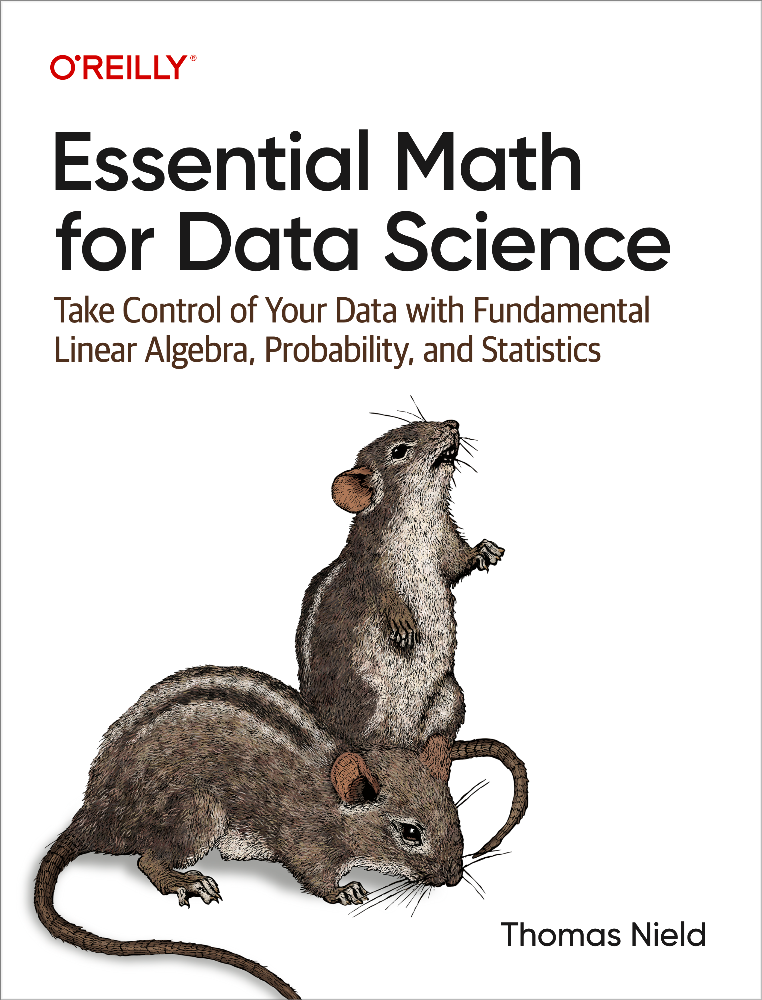

# Essential Math for Data Science (book)

<!-- PROJECT LOGO -->
 

  

<h3 align="center"> Essential Math for Data Science</h3>

  

    Solving the book's practice problems 
  

<!-- ABOUT THE PROJECT -->
## About The Project

The goal of this repository is to solve all the practice problems of the book with explanations.

(<a href="#readme-top">back to top</a>)

